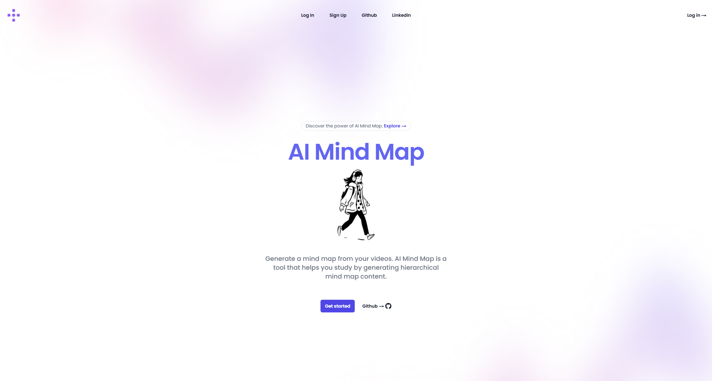

# AI Mind Map | AI-Powered Mind Map Generator

## What is it?
This project is an AI-powered system designed to generate mind maps from educational video lectures. It leverages OpenAI's natural language processing (NLP) models and prompt engineering techniques to extract and organize key concepts, improving study efficiency.

## Why was it created?
Students often struggle with information overload, especially in fields like medicine, where large amounts of content must be assimilated quickly. Studies indicate that this cognitive burden is a major stress factor. By automating the creation of structured mind maps, this tool aims to enhance learning and retention.

## Who is it for?
This project is intended for students, educators, and lifelong learners who need an efficient way to summarize and visualize educational content. Medical students, in particular, may find it beneficial given their intensive coursework.

## Where is it used?
It can be used in academic institutions, online learning platforms, and self-study environments. The tool can be integrated into e-learning applications or used as a standalone study aid.

## When should it be used?
This system is ideal for use when:
- Reviewing complex subjects from video lectures.
- Structuring study materials before exams.
- Organizing large volumes of information in an easily digestible format.

## How does it work?
1. The user uploads a video lecture.
2. The system transcribes the content using speech-to-text technology.
3. NLP models analyze the transcription to identify key concepts.
4. A structured mind map is generated, highlighting core ideas and relationships.
5. The user can export or refine the generated mind map for further use.

The following technologies were used to build this project:

**Front-End Technologies:**
*   **HTML** -  ` <HTML5> `
    *   The fundamental building block for most websites, defining the structure and content displayed in web browsers.
*   **CSS** -  `<CSS3>`
    *   Used to style web pages, ensuring the site's aesthetics and interactivity.
*  **Tailwind CSS** - `<tailwindcss>`
    *   A utility-first CSS framework allowing styles to be built directly in HTML using utility classes.
*   **JavaScript** - `<javascript>`
    *   A lightweight, interpreted, object-based language primarily used as a scripting language for web pages.
*   **TypeScript** - `<typescript>`
    *   A strongly typed superset of JavaScript that adds additional syntax for closer integration with code editors and early error detection.
*   **Next.js** - `<nextjs>`
     *  A framework for React that allows for more efficient app development, including server-side rendering.
*   **React Flow** - `<react>`
    *   An open-source library that facilitates the creation of interactive node-based UIs and diagrams.

**Back-End Technologies:**
*   **Node.js** - `<nodedotjs>`
    *   A free, open-source, cross-platform JavaScript runtime environment that allows developers to build various applications.
*   **Fastify** -  `<fastify>`
     * A web framework for Node.js that is optimized for high performance and provides support for plugins and an intuitive routing system.
*   **MongoDB** - `<mongodb>`
    *   A NoSQL document database that stores data in a flexible, JSON-like format.
*   **Prisma** - `<prisma>`
    *   An ORM (Object-Relational Mapper) that simplifies database interactions with its client, migration, and studio layers.
*   **TypeScript** - `<typescript>`
    *   As in the frontend, also used in the backend for improved tooling.
*   **Whisper** - `<openai>`
    *   An automatic speech recognition (ASR) system trained by OpenAI for multilingual transcription.
*   **ChatGPT** - `<openai>`
     * A language model by OpenAI, used for summarizing transcribed content and formatting data into JSON.

**Development Tools:**
*   **Visual Studio Code** - `<vscode>`
    *   A source code editor with features for code completion, debugging, and customization.
*   **Postman** - `<postman>`
    *   An API platform used for building and utilizing APIs, optimizing collaboration in the API lifecycle.
